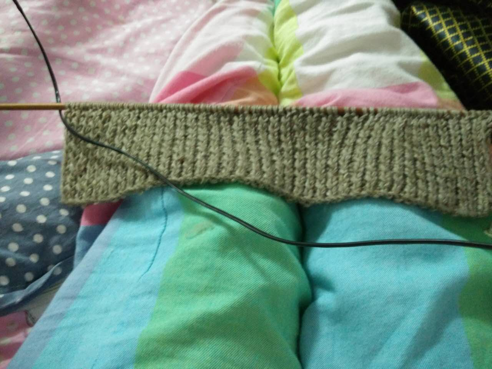
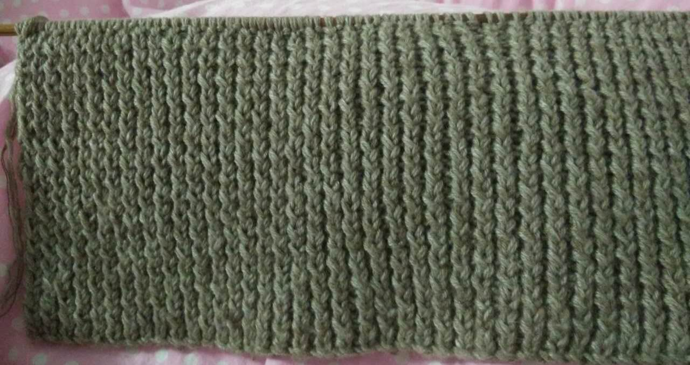
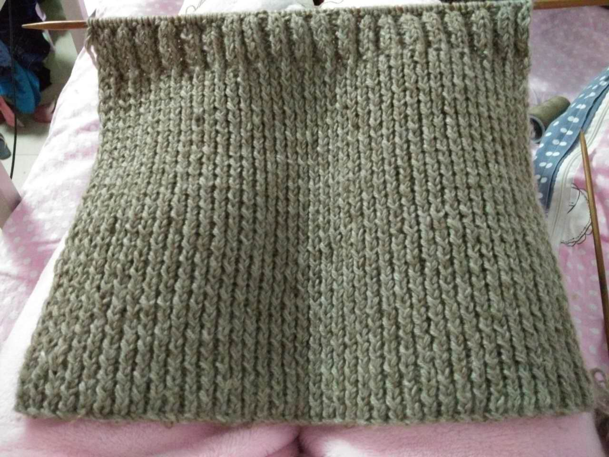
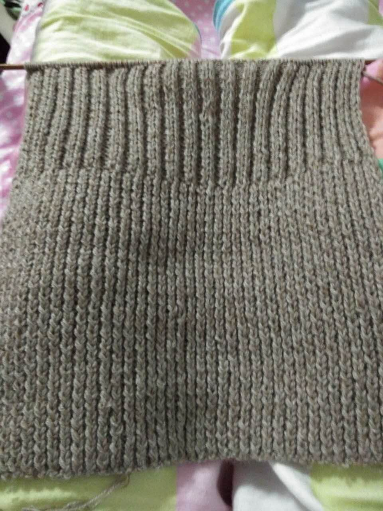
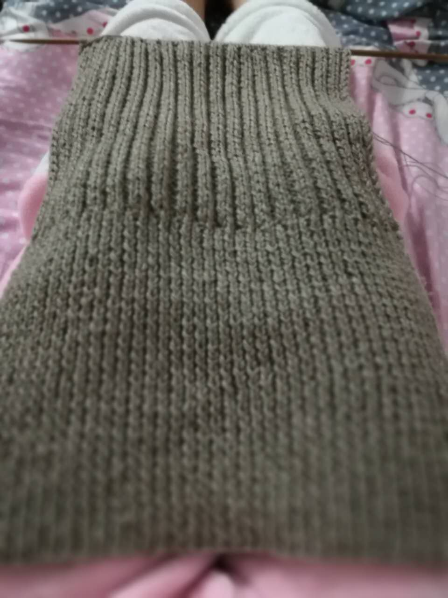

是我记错了吗
好像听到过好多次你对织围巾的羡慕
想织一条超级温暖的围巾
把你小小的脸包裹在里面
想想都好幸福
<!--more-->

### day1：买线开工
决定开织是从三姐那儿回来后
睡觉醒来发现你不在
赶紧开始挑针法选颜色
拉着俩妹妹商量到12点多

知道为什么上午去逛街了吗
我去买线呀傻妞
到店里发现选这么多没有用的
颜色好看的线手感不好
选中的舒服的线
又只有三个颜色
我当然选舒服啦
你会和我一样吗

老板姐姐一直劝我用粗线
怕我织到猴年马月
可是
我是处女座呀
我有我要的感觉
那种软软的温暖的味道
所以还是执拗的选了细线

回到宿舍就开织
找感觉拆了两次
还是小时候弄过的
有点忘记了

知道我为什么看电影迟到了吗傻妞
因为我想织好开始呀
晚饭回继续织
鹏敏那坏人说现在过了戴手织的年代
还说她要是织了
她蓝朋友也不会戴嫌丑
不自信了
可是织好的摸着很舒服呀

虎子
那么你呢
会怎么想呢
会珍惜吗
还是也会嫌弃
毕竟真的没有买的好看
没有机器的精细

### day2：继续
看着它越来越长开心
敲键盘的时候左手食指微微僵硬
果然是老胳膊老腿
一动就有后遗症
附上第二天成果图
是不是还挺快的

### day3：有点想偷懒了
中间歇了一天
有点想偷懒了
想躺床上看剧
因为织好的越来越丑了。。。

### day4：又开始了
其实不是第四天
中间和你嗨
偷懒了
鹏敏说还不如买一条
何必费那劲
我也有点觉得了
因为
一感觉打不完了
二不是很满意TT
不过还是挺长了吧
可以看出是围巾了吗

### day5：很快吧
今天和姐姐吃饭
杨buss看我手机相册
吓到小孩了
差点就被发现了
好险好险
长一点好些了
是不

### day6：很快吧
呀呀呀
时间紧迫啦

